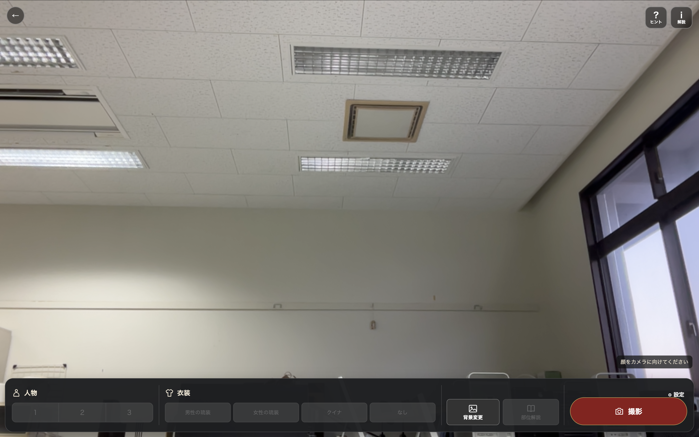
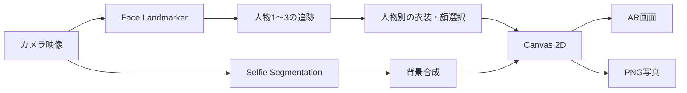

# 琉球衣装AR体験

## プロジェクト概要

### アプリ名

琉球衣装AR体験

### 概要

カメラに映った人物へ、琉装またはヤンバルクイナの画像をリアルタイムで重ねるブラウザアプリです。最大3人を同時に検出し、人物ごとに異なる表示を割り当てられます。海・石畳・首里城の背景切替、展示解説、文字サイズ変更、合成写真の保存にも対応しています。最初の画面で日本語・英語を選べます。

映像と顔検出はブラウザ内で処理し、カメラ映像をサーバーへ送信しません。バックエンドやデータベースを必要としない静的Webアプリです。

### 主な対象ユーザ

- 博物館や展示施設の来館者（小学生以上を対象）
- 琉球文化・沖縄の自然に関心がある学習者

## 主な機能

- 最大3人の顔を同時検出
- 最初の画面で日本語・英語を選択し、操作名・案内・展示解説を切り替え
- 人物ごとに「男性の琉装」「女性の琉装」「ヤンバルクイナ」「なし」を割当
- 広い画面では人物・衣装・背景／部位解説・撮影を横並びにした下部ドック。狭い画面では2行の操作帯と、横スクロールできる衣装メニュー
- 未検出人物のボタンを灰色・選択不可にし、検出中の人物だけを操作
- 選択中の人物・衣装・背景を強調表示し、認識人数を操作帯の上の右下に表示
- 顔の位置・大きさ・傾きに合わせた透過PNGの描画
- 人物番号の約5秒後のフェードアウトと、「人物設定」内からの番号の振り直し
- 背景なし・海・石畳・首里城（復元前）・首里城（復元後）の切替
- 下部の操作帯から開閉できる2行構成の背景選択パネル
- 男女の琉装・ヤンバルクイナに関する解説
- 右上のインフォメーションマークに小さな「解説」ラベルを表示
- インフォメーションマーク横の「ヒント」から、各操作の説明を吹き出しで順に表示
- キャプションの文字サイズを80〜160%で変更
- 顔ハメとは独立した「部位解説」モード（身体をポインタとして資料を読む）
- 指先を約1秒合わせるか画面をタッチして、袖・腰・頭／髪の解説を表示
- カメラ・背景・衣装を合成したPNG写真の保存
- 停止・再開時のカメラ、顔検出、背景処理の終了





### 展示内容を変更する場所

- **画像と選択ボタン名**：[exhibit-settings.mjs](exhibit-settings.mjs) の `outfits`・`backgrounds`。利用者が画像設定を編集するファイルはこれ1つです。
- **開始画面の導入文と展示キャプション**：[exhibit-text.mjs](exhibit-text.mjs) の `introText` と `exhibitText.ja/en` 内の `captions`・`details`。

既存の選択肢を差し替えるだけなら、HTMLや表示処理のファイルを編集する必要はありません。具体的な手順は下の「展示内容の差し替え」を参照してください。


## 使用技術

| 分類 | 技術 | 用途・状況 |
|---|---|---|
| Frontend | HTML5 / CSS / Vanilla JavaScript | UI、カメラ制御、状態管理 |
| Frontend | 自前の日本語・英語テキスト辞書 | ビルドや外部翻訳サービスなしで画面と解説を切替 |
| Frontend | Canvas 2D | 衣装、ヤンバルクイナ、背景、撮影画像の合成 |
| Computer Vision | MediaPipe Face Landmarker 0.10.9 | 最大3人の顔ランドマーク検出 |
| Computer Vision | MediaPipe Hand Landmarker 0.10.9 | 部位解説モードで最大2本の人差し指を検出 |
| Computer Vision | MediaPipe Selfie Segmentation 0.1.1675465747 | 人物と背景の分離 |
| Backend | なし | すべてブラウザ内で処理 |
| Database | なし | 永続データを保存しない |
| Authentication | なし | アカウント機能なし |
| Infrastructure | Python標準HTTPサーバー | ローカル起動 |
| Infrastructure | GitHub Pagesを想定 | HTTPSでの静的サイト公開。未設定 |
| CI/CD | GitHub Actionsを候補 | プロジェクト直下から公開用ファイルを選んでPagesへ配置。未実装 |
| Testing | Node.js標準ライブラリ | DOM・Canvas・追跡ロジックの模擬テスト |
| Testing | Chrome Headless | キャプションや画像デコードの実ブラウザ確認 |
| Development Tools | Git / GitHub | バージョン管理とIssue管理 |

CDNからMediaPipeのJavaScript、WASM、学習済みモデルを読み込みます。そのため、初回起動時はインターネット接続が必要です。

## 技術選定理由

### MediaPipe Face Landmarker

- `numFaces: 3`で複数人の顔ランドマークを取得できるため採用しました。
- 以前のMindAR/A-Frame構成は1人用の顔追跡には適していましたが、人物別の衣装割当や軽量な2D合成には構成が大きすぎました。
- 顔の両頬、額、顎、目の位置から、衣装の移動・拡大縮小・回転を計算できます。
- 制約として、遠距離の小さい顔、強い横顔、遮蔽、人物同士の交差では検出や番号対応が不安定になる場合があります。

### Canvas 2D

- 透過PNGを人物ごとに描画し、背景や撮影画像と同じ仕組みで合成できるため採用しました。
- WebGLや3Dフレームワークより構成が単純で、今回必要な2D顔ハメに処理を絞れます。
- DOM全体のスクリーンショットではなく必要なレイヤーだけを合成できるため、操作ボタンや人物番号を保存写真から除外できます。
- 2D画像のため、身体の姿勢に沿った衣服の変形や腕の前後関係は表現できません。

### Selfie Segmentation

- 背景変更時だけ人物を切り抜ける軽量なモデルとして採用しました。
- 顔追跡とは別周期で最大約10fpsに制限し、同時推論を避けています。
- 顔追跡と背景処理は別フレームで動くため、速い動きでは人物と衣装がずれる可能性があります。

### Hand Landmarkerと部位解説

- 顔ハメは顔に追従するため、本人の顔と衣装の相対位置が変わりません。そのため、身体をポインタにする操作には人差し指を使います。
- 通常の顔ハメ中は手認識を行わず、「部位解説」をオンにしたときだけ最大約6fpsで動かします。
- 手認識を利用できない環境でも、同じ衣装部位を画面タッチして解説できます。

### Vanilla JavaScript・ビルド不要構成

- 展示用PCで依存パッケージをインストールせず、静的サーバーだけで起動できることを重視しました。
- 展示の画像設定と文章はブラウザが直接読み込める`.mjs`ファイルに分け、ビルドせずにファイルを編集・再読み込みするだけで更新できるようにしました。
- Reactなどのフレームワークも候補になりますが、画面数が少なく、主要処理がCanvasとMediaPipeで完結するため採用していません。
- メリットは配布と起動が簡単なことです。デメリットは、大規模化した場合にUI状態管理やモジュール分割を手動で設計する必要があることです。
- 多言語化も外部サービスを使わず、固定の日本語・英語テキストとキャプションデータを切り替えます。カメラ映像や入力内容を翻訳サービスへ送信しません。

## ディレクトリ構成

```text
博物館AR/
├── ARを起動.command               # macOS用ローカル起動スクリプト
├── README.md                     # 概要・起動方法・展示内容の編集手順
├── LOG.md                        # 指示と作業結果の履歴
├── index.html                    # 画面構造と操作UI
├── exhibit-settings.mjs          # 画像パス・選択ボタン名・位置合わせ
├── exhibit-text.mjs              # 導入文と日英の展示キャプション
├── assets/
│   ├── css/app.css               # 画面全体のスタイル
│   ├── js/                       # 顔追跡・背景・衣装・UIの各モジュール
│   └── images/                   # 衣装・顔ハメ・背景画像
├── tests/                        # Node.jsによる自動テスト
└── reference/                    # 参考素材と旧実装
```

ブラウザが読み込むファイルは`assets/`、検査コードは`tests/`、現行アプリで使用しない素材と旧実装は`reference/`に分けています。新しい画像を追加する場合も、用途に対応する`assets/images/`配下へ配置してください。



## 環境構築

### 必要環境

- Python 3
- Node.js（自動テストを実行する場合）
- カメラを利用できるPCまたはスマートフォン
- SafariまたはChrome
- 動作確認済み：Chrome Ver. 153.0.8010.48(Arm64)・Safari バージョン27.0 (20625.1.29.18.28)
- 初回モデル読込用のインターネット接続

`npm install`は不要です。

### ローカル起動

macOSでは、プロジェクト直下の`ARを起動.command`をダブルクリックします。

起動後に表示されるターミナルは、ARを利用している間は閉じないでください。ターミナルを閉じるか`Control + C`を押すとローカルサーバーが停止し、`http://127.0.0.1:8000/`へ接続できなくなります。

すでに8000番ポートでこのアプリが起動している状態で起動スクリプトをもう一度実行した場合は、二重起動せず、起動済みであることを表示して終了します。別のアプリケーションが8000番ポートを使っている場合は、そのアプリケーションを終了してから再実行してください。

ターミナルから起動する場合は、プロジェクト直下で次を実行します。

```sh
python3 -m http.server 8000 --bind 127.0.0.1
```

ブラウザで次のURLを開きます。

```text
http://127.0.0.1:8000/
```

`index.html`を`file://`で直接開かないでください。カメラAPI、JavaScriptモジュール、画像読込が正常に動かない場合があります。localhost以外へ公開する場合はHTTPSが必要です。

### テスト

プロジェクト直下で実行します。

```sh
node tests/check-multiface.mjs
node tests/check-assignments.mjs
node tests/check-background.cjs
node tests/check-photo-capture.mjs
node tests/check-caption.mjs
node tests/check-costume-details.mjs
node tests/check-costume-overlay.mjs
node tests/check-vision-models.mjs
node tests/check-layout.mjs
node tests/check-language.mjs
node tests/check-hints.mjs
node tests/check-exhibit-content.mjs
```

テストは追跡、人物別割当、未検出ボタンの無効化、背景切替、撮影レイヤー、Markdownキャプション、部位タッチ・指先滞在からキャプション表示まで、操作帯の配置、日英切替、ヒント案内、展示設定と文章ファイルからの反映を検査します。顔入力、DOM、Canvas、背景モデルの一部は模擬値であり、実カメラの精度・性能を保証するものではありません。

## Usage

### 基本操作

1. ローカルサーバーまたはHTTPSの公開URLからアプリを開きます。
2. 最初の画面で「日本語」または「English」を選びます。初期設定は日本語です。選択はそのページを開いている間だけ有効で、再読み込み時は日本語に戻ります。
3. 「AR体験を始める」（英語では「Start AR experience」）を押し、カメラ利用を許可します。
4. 顔が検出されると、人物1〜3のボタンが有効になります。未検出の人物は灰色で選択できません。
5. 下部で操作する人物を選び、男性の琉装・女性の琉装・クイナ（ヤンバルクイナ）・なしを選択します。広い画面では衣装ボタンが横並びで表示されます。狭い画面では「衣装」を開き、候補を横にスクロールできます。
6. 顔の上の人物番号は約5秒後に消えます。人物が交差して番号が入れ替わった場合は「設定」（読み上げ名は「人物設定」）を開き、「番号を左から振り直す」を押します。
7. 下部の「背景変更」（狭い画面では「背景」）を開き、なし・海・石畳・首里城（復元前）・首里城（復元後）を選択します。選択状態はパネル内で確認できます。
8. 右上の「i 解説」から展示解説を開きます。本文も選んだ言語で表示され、「文字サイズ」バーで80〜160%に変更できます。
   操作が分からないときは、その左にある「? ヒント」を押します。人物・衣装・背景・部位解説・撮影・人物設定・展示解説・終了の説明が、各操作の近くに吹き出しで表示されます。「次へ」「戻る」で移動し、「×」またはEscキーで閉じます。
9. 部分ごとの解説を読む場合は、琉装を選んで下部の「部位解説」を押します。衣装上の額付近（男性は頭、女性は髪）・袖や手首・腰へ人差し指を約1秒合わせます。画面上の同じ部分をタッチしても表示できます。
10. 下部の「撮影」を押すと、カメラ、背景、衣装を合成したPNGを保存します。広い画面ではドック右端、狭い画面では下部中央にあります。指先のマークや部位解説の案内は保存画像に含まれません。
11. 左上の矢印を押すと、カメラ、顔検出、手検出、背景処理を停止して開始画面へ戻ります。言語は最初の画面で再選択できます。


### 画面レイアウト

- 画面幅900px以上では、人物・衣装・背景変更／部位解説・撮影を区切った横長ドックを表示します。撮影は右端、設定はドック右上です。
- 900px未満では下部を2行に収め、衣装は開閉式の一列メニューに切り替わります。撮影は下部中央です。
- 認識人数はドックの上の右下に表示します。人物の画面上の番号は約5秒で消えますが、人物選択ボタンは残ります。
- 選択中のボタンは赤色などで区別し、未検出の人物ボタンは灰色で選択できません。

### 写真撮影

- ファイル名は`ryukyu-ar-YYYYMMDD-HHMMSS.png`です。
- 背景の準備中は撮影できません。
- 操作ボタン、人物番号、認識人数、ガイド、メッセージは保存画像に含めません。
- 保存先やダウンロード確認はブラウザの設定に従います。

### 展示内容の差し替え

#### 画像と選択ボタン名

編集するファイルは **[exhibit-settings.mjs](exhibit-settings.mjs) だけ**です。`outfits` は男性・女性の琉装とヤンバルクイナ、`backgrounds` は4種類の背景に対応します。各項目の `name.ja`・`name.en` がボタン名、`image` が画像パスです。パスはプロジェクト直下からの相対パスで指定します。

| 設定のキー | 初期状態のボタン | 初期状態の画像 |
|---|---|---|
| `outfits.man` | 男性の琉装 | `assets/images/costumes/orion-man.png` |
| `outfits.woman` | 女性の琉装 | `assets/images/costumes/orion-woman.png` |
| `outfits.bird` | ヤンバルクイナ | `assets/images/face-overlays/yanbaru-kuina.png` |
| `backgrounds.beach` | 海 | `assets/images/backgrounds/beach.jpg` |
| `backgrounds.stone` | 石畳 | `assets/images/backgrounds/ishidatami.jpg` |
| `backgrounds['castle-before']` | 首里城（復元前） | `assets/images/backgrounds/shurijo-before.jpg` |
| `backgrounds['castle-after']` | 首里城（復元後） | `assets/images/backgrounds/shurijo-after.jpg` |

1. 新しい画像を `assets/images/` の適切な場所へ置きます。衣装・顔画像は、背景と顔が見える穴を透明にしたPNGを使います。背景画像にはJPEGやPNGを使えます。
2. `exhibit-settings.mjs` の対象項目で、`image` を新しい画像のパスへ、`name.ja`・`name.en` を表示したい名前へ変更します。ヤンバルクイナの短いボタン表示も変える場合は `shortName.ja`・`shortName.en` を変更します。`man` や `beach` などのキーは変えません。
3. 再読み込み後、対象ボタン、顔ハメ位置、背景の切り抜き、撮影画像を確認します。衣装を交換した場合は「部位解説」のタッチ位置も確認します。

「人物1〜3」は画像の種類ではありません。各人物が `outfits` の同じ選択肢から衣装・顔画像を選びます。背景は画面比率に合わせて中央から切り抜かれます。

元画像と縦横比や顔穴・頭部位置が違う場合も、同じファイル下部の `alignment` だけで調整できます。男性・女性は `size`（座標の基準サイズ）、`faceHole`（顔穴の中心と幅・高さ）、`regions`（頭／髪・袖・腰のタッチ範囲）を設定します。ヤンバルクイナは `size`、`headBounds`、`headScale` を設定します。既定の男性・女性は683×1024、ヤンバルクイナは1254×1254を座標の基準にしています。既存の選択肢を差し替える用途です。選択肢の数を増やす場合は画面と処理の追加が必要です。

#### 導入文とキャプション

編集するファイルは **[exhibit-text.mjs](exhibit-text.mjs) だけ**です。開始画面の見出し・サブタイトル・3行の導入文は `introText.ja` と `introText.en` にあります。展示解説の見出しと本文は `exhibitText.ja.captions`・`exhibitText.en.captions`、袖・腰・頭／髪の解説は `exhibitText.ja.details`・`exhibitText.en.details` にあります。ファイル内の共通本文（`ryusoMarkdownJa/En`、`sleeveMarkdownJa/En` など）を編集すると、対応するキャプションへ反映されます。

`man`・`woman`・`bird` や `sleeve`・`waist`・`head`・`hair` のキーは画面との対応に使うため、変更しないでください。

本文はバッククォート（`` ` ``）で囲まれたMarkdown文字列です。段落は空行、見出しは `##`・`###`、強調は `**太字**`・`*斜体*`、リンクは `[表示名](https://...)` で書けます。日本語と英語の両方を表示する場合は両方の文章を更新してください。画像の題材を変えた場合は、対応するキャプションも確認します。

### キャッシュ更新

画像やJavaScriptを変更したのに表示が変わらない場合は、Macで`Command + Shift + R`を押して強制再読み込みします。必要に応じてブラウザのサイトデータを削除してください。

`exhibit-settings.mjs`と`exhibit-text.mjs`の編集では、HTMLの`?v=`を変更する必要はありません。再読み込みで反映されないときだけ強制再読み込みしてください。

`assets/css/app.css`、`assets/js/background.js`、`assets/js/caption-panel.mjs`、`assets/js/multiface.mjs`を更新した場合は、`index.html`の読込URLにある`?v=`も変更し、旧ファイルが再利用されないようにします。`language.mjs`などのimport先を変更した場合は、参照元のimportにある`?v=`と、それを読み込むHTMLの`?v=`も更新します。


### 文献・画像利用について

画像を引用し，一部加工
[Orion | 琉球王国の華やかな風情をまとう民族衣装「琉装」](https://www.orionbeer.co.jp/story/ryuso/)

背景引用：
[おきなわ物語 | 首里金城町の石畳道(県指定史跡)](https://www.okinawastory.jp/spot/1360)・[沖縄タイムズ | 首里城正殿外観]https://www.okinawatimes.co.jp/articles/-/1644631


キャプションの参考文献：[weblio辞書 | 琉装](https://www.weblio.jp/content/%E7%90%89%E8%A3%85)


### 注意

- 人物番号は顔認証ではなく画面上の位置で対応付けます。交差・遮蔽・長い離席では番号が入れ替わる可能性があります。
- 最大検出人数は3人です。
- 遠距離の小さい顔、横顔、手で隠れた顔は認識しにくくなります。
- 2D画像のため、全身の姿勢や腕の前後関係に合わせた変形は行いません。
- 背景処理と顔追跡が別周期のため、速い動きでは一時的にずれる場合があります。
- 手認識は部位解説モード中だけ最大2本・約6fpsで行います。手が隠れている場合や指先が小さい場合は、画面タッチを利用してください。
