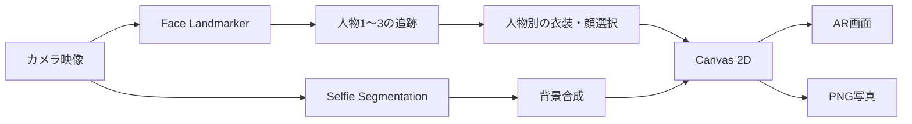

# 琉球衣装AR体験

## プロジェクト概要

### アプリ名

琉球衣装AR体験

### 概要

カメラに映った人物へ、琉装またはヤンバルクイナの画像をリアルタイムで重ねるブラウザアプリです。最大3人を同時に検出し、人物ごとに異なる表示を割り当てられます。海・石畳・首里城の背景切替、展示解説、文字サイズ変更、合成写真の保存にも対応しています。

映像と顔検出はブラウザ内で処理し、カメラ映像をサーバーへ送信しません。バックエンドやデータベースを必要としない静的Webアプリです。

### 主な対象ユーザ

- 博物館や展示施設の来館者（小学生以上を対象）
- 琉球文化・沖縄の自然に関心がある学習者

## 主な機能

- 最大3人の顔を同時検出
- 人物ごとに「男性の琉装」「女性の琉装」「ヤンバルクイナ」「なし」を割当
- 未検出人物のボタンを灰色・選択不可にし、検出中の人物だけを操作
- 顔の位置・大きさ・傾きに合わせた透過PNGの描画
- 人物番号の約5秒後のフェードアウトと、番号の振り直し
- 背景なし・海・石畳・首里城（復元前）・首里城（復元後）の切替
- 開閉できる2行構成の背景選択パネル
- 男女の琉装・ヤンバルクイナに関する解説
- キャプションの文字サイズを80〜160%で変更
- カメラ・背景・衣装を合成したPNG写真の保存
- 停止・再開時のカメラ、顔検出、背景処理の終了

## 使用技術

| 分類 | 技術 | 用途・状況 |
|---|---|---|
| Frontend | HTML5 / CSS / Vanilla JavaScript | UI、カメラ制御、状態管理 |
| Frontend | Canvas 2D | 衣装、ヤンバルクイナ、背景、撮影画像の合成 |
| Computer Vision | MediaPipe Face Landmarker 0.10.9 | 最大3人の顔ランドマーク検出 |
| Computer Vision | MediaPipe Selfie Segmentation 0.1.1675465747 | 人物と背景の分離 |
| Backend | なし | すべてブラウザ内で処理 |
| Database | なし | 永続データを保存しない |
| Authentication | なし | アカウント機能なし |
| Infrastructure | Python標準HTTPサーバー | ローカル起動 |
| Infrastructure | GitHub Pagesを想定 | HTTPSでの静的サイト公開。未設定 |
| CI/CD | GitHub Actionsを候補 | `files/`から公開用ファイルを選んでPagesへ配置。未実装 |
| Testing | Node.js標準ライブラリ | DOM・Canvas・追跡ロジックの模擬テスト |
| Testing | Chrome Headless | キャプションや画像デコードの実ブラウザ確認 |
| Development Tools | Git / GitHub | バージョン管理とIssue管理 |

CDNからMediaPipeのJavaScript、WASM、学習済みモデルを読み込みます。そのため、初回起動時はインターネット接続が必要です。

## 技術選定理由

### MediaPipe Face Landmarker

- `numFaces: 3`で複数人の顔ランドマークを取得できるため採用しました。
- 以前のMindAR/A-Frame構成は1人用の顔追跡には適していましたが、人物別の衣装割当や軽量な2D合成には構成が大きすぎました。
- 顔の両頬、額、顎、目の位置から、衣装の移動・拡大縮小・回転を計算できます。
- 制約として、遠距離の小さい顔、強い横顔、遮蔽、人物同士の交差では検出や番号対応が不安定になる場合があります。

### Canvas 2D

- 透過PNGを人物ごとに描画し、背景や撮影画像と同じ仕組みで合成できるため採用しました。
- WebGLや3Dフレームワークより構成が単純で、今回必要な2D顔ハメに処理を絞れます。
- DOM全体のスクリーンショットではなく必要なレイヤーだけを合成できるため、操作ボタンや人物番号を保存写真から除外できます。
- 2D画像のため、身体の姿勢に沿った衣服の変形や腕の前後関係は表現できません。

### Selfie Segmentation

- 背景変更時だけ人物を切り抜ける軽量なモデルとして採用しました。
- 顔追跡とは別周期で最大約10fpsに制限し、同時推論を避けています。
- 顔追跡と背景処理は別フレームで動くため、速い動きでは人物と衣装がずれる可能性があります。

### Vanilla JavaScript・ビルド不要構成

- 展示用PCで依存パッケージをインストールせず、静的サーバーだけで起動できることを重視しました。
- Reactなどのフレームワークも候補になりますが、画面数が少なく、主要処理がCanvasとMediaPipeで完結するため採用していません。
- メリットは配布と起動が簡単なことです。デメリットは、大規模化した場合にUI状態管理やモジュール分割を手動で設計する必要があることです。

## ディレクトリ構成

```text
博物館AR/
├── ARを起動.command               # macOS用ローカル起動スクリプト
└── files/
    ├── index.html                 # 画面、操作UI、キャプション
    ├── multiface.mjs              # カメラ、顔検出、人物別割当、衣装描画
    ├── face-slots.mjs             # 人物番号の追跡
    ├── background.js              # 人物切り抜きと背景合成
    ├── photo-capture.mjs          # 撮影用レイヤー合成
    ├── orion_man.png              # 男性の琉装
    ├── orion_woman.png            # 女性の琉装
    ├── yanbarukuina.png           # ヤンバルクイナの頭部
    ├── background_beach.jpg       # 海
    ├── background_ishidatami.jpg  # 石畳
    ├── background_Shurijo_Castle_before.jpg
    ├── background_Shurijo_Castle_after.jpg
    ├── check-multiface.mjs        # 顔追跡テスト
    ├── check-assignments.mjs      # 人物別割当・無効化テスト
    ├── check-background.cjs       # 背景テスト
    ├── check-photo-capture.mjs    # 撮影合成テスト
    ├── check-caption.cjs          # キャプション表示テスト
    ├── README.md
    └── LOG.md
```

`AI-generated image/`、`figure_original/`、`*_origin.png`、webloc、`costume-fit.js`は参考・旧実装用で、現行アプリの実行には使用しません。



## 環境構築

### 必要環境

- Python 3
- Node.js（自動テストを実行する場合）
- カメラを利用できるPCまたはスマートフォン
- SafariまたはChrome
- 動作確認済み：Chrome Ver. 153.0.8010.48(Arm64)・Safari バージョン27.0 (20625.1.29.18.28)
- 初回モデル読込用のインターネット接続

`npm install`は不要です。

### ローカル起動

macOSでは、プロジェクト直下の`ARを起動.command`をダブルクリックします。

ターミナルから起動する場合は、プロジェクト直下で次を実行します。

```sh
python3 -m http.server 8000 --bind 127.0.0.1 --directory files
```

ブラウザで次のURLを開きます。

```text
http://127.0.0.1:8000/
```

`index.html`を`file://`で直接開かないでください。カメラAPI、JavaScriptモジュール、画像読込が正常に動かない場合があります。localhost以外へ公開する場合はHTTPSが必要です。

### テスト

プロジェクト直下で実行します。

```sh
node files/check-multiface.mjs
node files/check-assignments.mjs
node files/check-background.cjs
node files/check-photo-capture.mjs
node files/check-caption.cjs
```

テストは追跡、人物別割当、未検出ボタンの無効化、背景切替、撮影レイヤー、Markdownキャプションを検査します。顔入力、DOM、Canvas、背景モデルの一部は模擬値であり、実カメラの精度・性能を保証するものではありません。

## Usage

### 基本操作

1. ローカルサーバーまたはHTTPSの公開URLからアプリを開きます。
2. 「AR体験を始める」を押し、カメラ利用を許可します。
3. 顔が検出されると、人物1〜3のボタンが有効になります。未検出の人物は灰色で選択できません。
4. 操作する人物を選び、「男性の琉装」「女性の琉装」「ヤンバルクイナ」「なし」を選択します。
5. 顔の上の人物番号は約5秒後に消えます。人物が交差して番号が入れ替わった場合は「番号を左から振り直す」を押します。
6. 「背景を選ぶ」を開き、なし・海・石畳・首里城（復元前）・首里城（復元後）を選択します。
7. インフォメーションマークから展示解説を開きます。「文字サイズ」バーで80〜160%に変更できます。
8. 「📷 撮影」を押すと、カメラ、背景、衣装を合成したPNGを保存します。
9. 左上の矢印を押すと、カメラ、顔検出、背景処理を停止して開始画面へ戻ります。

### 写真撮影

- ファイル名は`ryukyu-ar-YYYYMMDD-HHMMSS.png`です。
- 背景の準備中は撮影できません。
- 操作ボタン、人物番号、認識人数、ガイド、メッセージは保存画像に含めません。
- 保存先やダウンロード確認はブラウザの設定に従います。

### 画像の配置と調整

- 男性画像は2732×4096、女性画像は1366×2048のRGBA PNGです。
- 描画時は683×1024相当に縮小します。
- 男性の顔穴は旧683×1024基準で`(306,189)〜(371,268)`、女性は`(313,239)〜(375,315)`です。
- ヤンバルクイナは1254×1254で、頭部範囲`(58,99)〜(1194,1148)`を基準にします。
- 画像を交換した場合は、`multiface.mjs`内の顔穴・頭部座標も調整してください。

### キャッシュ更新

画像やJavaScriptを変更したのに表示が変わらない場合は、Macで`Command + Shift + R`を押して強制再読み込みします。必要に応じてブラウザのサイトデータを削除してください。

`background.js`と`multiface.mjs`を更新した場合は、`index.html`の読込URLにある`?v=`も変更し、旧JavaScriptが再利用されないようにします。


### 文献・画像利用について

画像を引用し，一部加工
https://www.orionbeer.co.jp/story/ryuso/
背景引用
https://www.kkday.com/ja/blog/38226/asia-japan-okinawa-beach-2?srsltid=AU7gw4VbkjWKJ-9N6qkfT87X-mFMCF_0iPPDUi2eq9NcEw52HwMdusY4
https://www.okinawastory.jp/spot/1360
https://www.okinawatimes.co.jp/articles/-/1644631


キャプションの参考文献
https://www.weblio.jp/content/%E7%90%89%E8%A3%85


### 注意

- 人物番号は顔認証ではなく画面上の位置で対応付けます。交差・遮蔽・長い離席では番号が入れ替わる可能性があります。
- 最大検出人数は3人です。
- 遠距離の小さい顔、横顔、手で隠れた顔は認識しにくくなります。
- 2D画像のため、全身の姿勢や腕の前後関係に合わせた変形は行いません。
- 背景処理と顔追跡が別周期のため、速い動きでは一時的にずれる場合があります。
- 長時間運転時の性能、SafariとChromeの全端末、実カメラからの写真保存は継続して確認が必要です。
